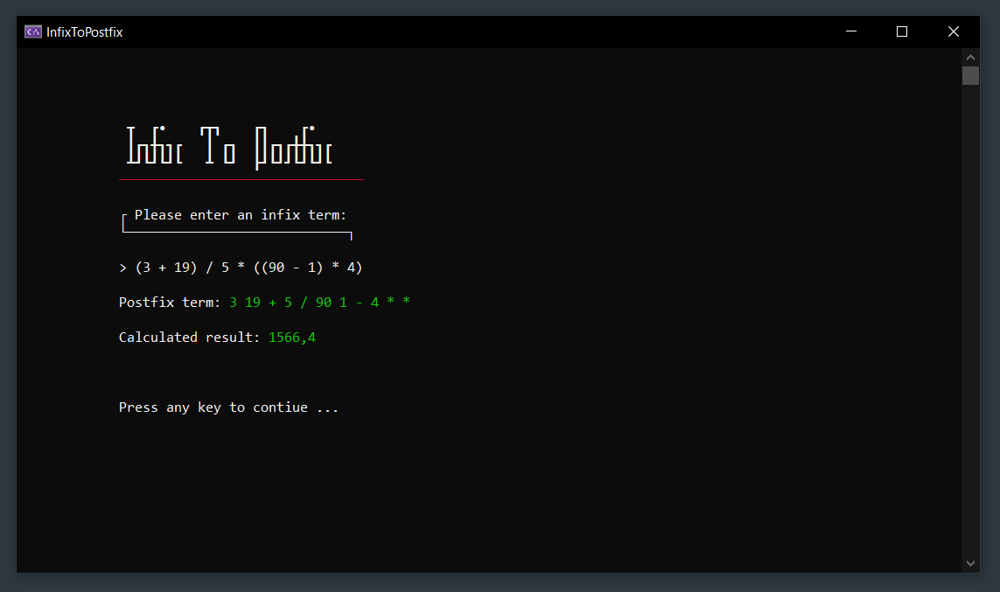

<br>

<h1 align="center">
  InfixToPostfix
</h1>

---

The goal of this project is to convert an infix term to the postfix notation and calculate its result.
The postfix notation is also known as the [_"Reverse Polish notation"_](https://en.wikipedia.org/wiki/Reverse_Polish_notation).

---

## Other services used
- The website [patorjk.com](https://patorjk.com/software/taag/#p=display&f=Tmplr) was used for creating headers within the application.

## How it Works

- User of the application enters an infix term.
- The input will be validated.
- After the validation process, the input will be converted to a postfix term.
- Afterwards the converted postfix term will be evaluated.
- The result and the postfix term itself will be displayed to the console.

## Supported operators
```
/ dividing
* multipling
+ addition
- subtracting
```

## How to Run

1. Clone this repository:
   ```bash git clone https://github.com/mLoDar/InfixToPostfix.git```

2. Open the solution file `(.sln)` in Visual Studio.

3. Build the project and run it.

## Screenshots

<p align="center">
    
</p>

---

<p align="center">
    <i>
        Feel free to submit pull requests or issues!
    </i>
</p>
